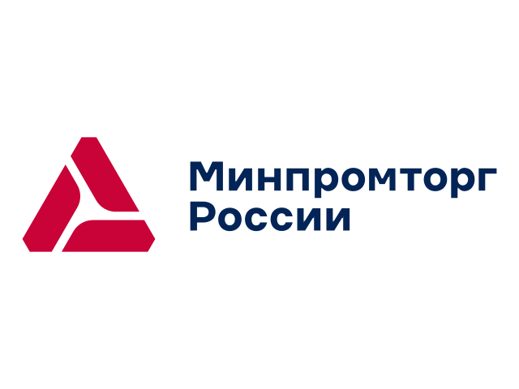
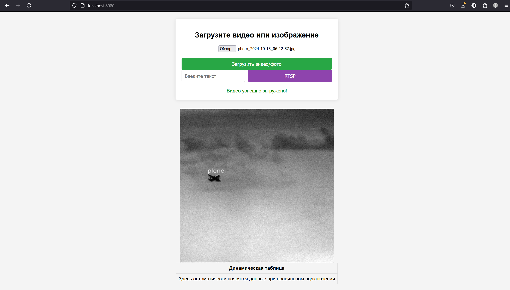

<div align="center">
  
# ЦИФРОВОЙ ПРОРЫВ: СЕЗОН ИИ <br> Обнаружение воздушных объектов с помощью анализа видеоинформации



</div> 


## Оглавление
- ### [Задание](#1)
- ### [Запуск кода](#3)
- ### [Уникальность нашего решения](#4)
- ### [Стек](#5)
- ### [Команда](#6)
- ### [Ссылки](#7)

## <a name="1"> Задание </a>

Современные технологии активно развиваются, и беспилотные летательные аппараты становятся все более распространенными в различных сферах, включая гражданскую и промышленную. Это создает необходимость разработки эффективных систем для их обнаружения и распознавания, которые могли бы предотвратить угрозы гражданской и промышленной безопасности.

Участникам предлагается разработать прототип программно-аппаратного модуля в виде веб-сервиса, который с помощью нейронных сетей будет анализировать видеоинформацию с ТВ и ИК камер для обнаружения летательных аппаратов.


## <a name="3">Запуск кода </a>

### Последовательные шаги для запска кода:
1. Склонировать гит репозиторий;
```Bash
git clone https://github.com/Fact0RR/Helicopter_Paracopter.git
```

2. Запустить сборку контейнеров:
```Bash
cd Helicopter_Paracopter
docker-compose build
docker-compose up
```

3. Перейти по адресу ```localhost:8080```


<div align="center">
  



Веб-интерфейс

</div> 

## <a name="4">Уникальность нашего решения </a>

1. Детекция летательных аппаратов небольшого размера при маленьком разрешении

2. Быстрая скорость работы за счет выбора подходящей модели

3. Работа как с отдельными изображения, так и с видеопотоком, в том числе по протоколу **RTSP**. 

4. Удобный веб-интерфейс для работы с решением.

## <a name="5">Стек </a>
<div align="center">
  &nbsp;
  &nbsp;
  &nbsp;
  &nbsp;
  
  &nbsp;
  &nbsp;
  &nbsp;
  
</div>

## <a name="6">Команда </a>

*Состав команды **"AI Crusades"***   

- <h4>: @facT0RR, Маслов Денис - Fullstack-developer</h3>
- <h4>: @BuldakovN, Булдаков Никита - CV-engineer</h3>
- <h4>: @uihlk, Карпова Анна - CV-engineer</h3>
- <h4>: @Skadar7, Кузнецов Денис - CV-engineer</h3>
- <h4>: @Llaceyne, Гулария Лана - Designer, Frontend-developer</h3>

## <a name="7">Ссылки </a>

- [ссылка на скринкаст](https://drive.google.com/drive/folders/1AV1OihR0tMgg06eclJ7MylKVASHN3H-E)&nbsp;
